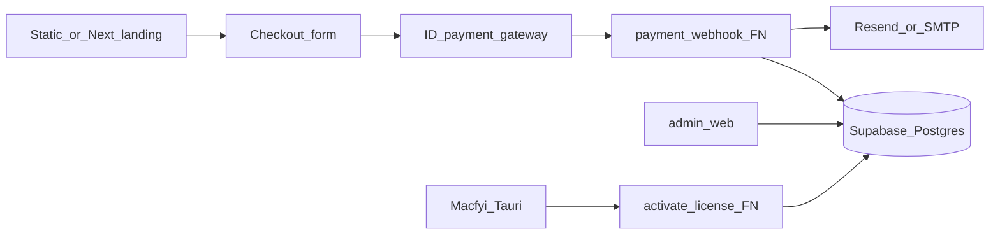

# Macfyi marketing ecosystem

This document ties together the desktop app, Supabase backend, admin UI, static funnel, and how an AI agent can draft a landing page.

## Architecture

- **Single database (Supabase):** licenses (hashed keys), `activations` (one device per license), `app_settings` (price, URLs, CRM webhook), `payment_events` (idempotency).
- **Landing + checkout:** Host [`funnel-site/`](../funnel-site/) or a Next.js site. The form submits to your **payment provider** (Midtrans, Xendit, etc.). The provider calls **`payment-webhook`** with a signed payload; the function verifies payment, inserts a license row, and optionally sends email (e.g. via Resend).
- **Email:** DMG download link (from `app_settings.download_base_url` or signed URL) plus **plain license key** once.
- **Desktop app:** Calls **`activate-license`** with email, license key, and device fingerprint; receives a session token stored locally.
- **Admin (`admin-web/`):** Supabase Auth with `app_metadata.role = "admin"`; manages settings, keys, and views license rows (RLS policies in migrations).

Optional: **`crm_webhook_url`** in `app_settings` — Edge Function or backend job POSTs order events to Zapier, Google Sheets, or a CRM.

## Prompt for an AI agent (landing page)

Use this with your documentation or README as extra context.

---

**Role:** You are a product copywriter and marketer.

**Product — Macfyi:** A native macOS utility that helps users understand disk usage, clean caches and clutter **with explicit risk labels** (safe / caution / risky), uninstall apps with related Library paths, manage Trash, monitor free space, inspect performance (RAM, launch agents, light maintenance commands), and ask an **on‑device–style AI assistant** that avoids sending full file paths for privacy.

**Audience:** Mac users running low on storage who are afraid of deleting the wrong file.

**Task:** Produce a **single-page landing** structure:

1. **Hero:** benefit-led headline, subhead, primary CTA to checkout, secondary CTA (e.g. download trial if applicable).
2. **3–5 features** with short titles and one line each (storage clarity, safe cleanup, uninstaller, performance, privacy-aware AI).
3. **Pricing:** lifetime license, one device, **Rp 173.000** (adjust if settings differ).
4. **FAQ:** at least two items on **privacy** (folder access, what is sent to servers) and **refunds / support** placeholders.
5. **Footer:** links to Terms and Privacy (URLs from admin settings in production).

**Output format:** Semantic HTML outline (`<main>`, `<section>`, headings `h1`–`h3`), suggested **meta description** (≤160 characters), and **no claims** not supported by the product (e.g. do not promise “100% recovery” or “certified antivirus”).

**Tone:** Professional, calm, reassuring — not alarmist.

---

## Repo pointers

| Piece | Location |
|--------|----------|
| Migrations & Edge Functions | [`supabase/`](../supabase/) |
| Admin UI | [`admin-web/`](../admin-web/) |
| Static funnel | [`funnel-site/`](../funnel-site/) |
| Activation & license gate (app) | [`src/lib/activation.ts`](../src/lib/activation.ts), [`src/components/ActivationScreen.tsx`](../src/components/ActivationScreen.tsx) |
